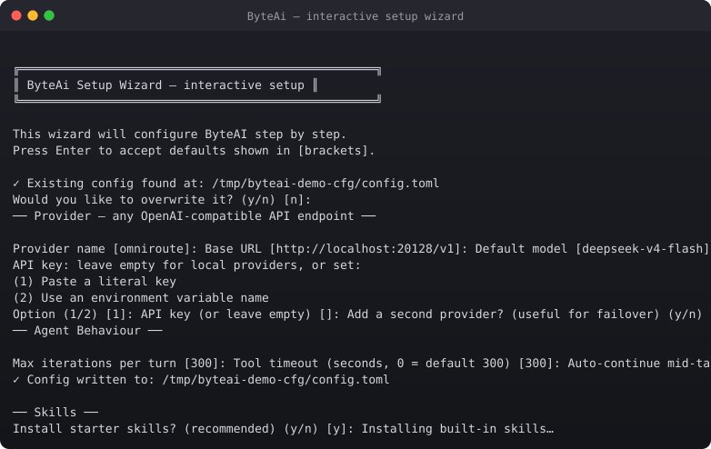
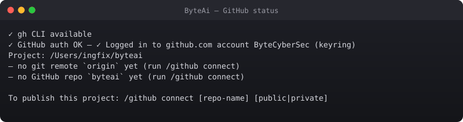

# ByteAi

[](https://github.com/ByteCyberSec/byteai/actions/workflows/ci.yml)
[](LICENSE)
[](https://www.rust-lang.org)
[](https://github.com/ByteCyberSec/byteai)

> **The fastest, smartest autonomous coding agent.**
> Rust core — zero Python/Node dependency. Provider-agnostic (any OpenAI-compatible endpoint). Runs locally or in the cloud.

---

## Features

- **Fast Rust core** — cold start < 100 ms, idle RAM < 50 MB
- **Provider-agnostic** — works with any OpenAI-compatible API (OmniRoute, OpenAI, Groq, Together, local models)
- **Smart tool selection** — only relevant tools per turn (kills context rot)
- **LSP-aware editing** — smart reads, patches, completions (Cargo, TypeScript, Python, Go, Rust)
- **DAP debugging** — multi-language debugger integration
- **Multi-agent delegation** — spawn up to 1000 parallel subagents, round-robin across providers, dead-provider detection, automatic retry
- **Persistent terminal** — `/terminal` keeps shell sessions alive with state (cwd, env, history) surviving across tool calls
- **Context spill** — oversized tool output is auto-saved to a spill artifact + bounded preview + locator (no silent truncation, no context rot)
- **Durable goal** — `/goal` sets one completion objective that survives restart/resume and anchors auto-continue
- **Feedback** — `/feedback` records human remarks + per-message ratings as signals about output (never fed to the model)
- **Memory hub** — persistent SQLite+FTS5 memory across sessions (L0 conversations, L1 atomics, L2 scenarios, L3 persona, skills)
- **Skills system** — load/install SKILL.md files, engineering discipline, lesson capture
- **Terminal UI** — oh-my-pi inspired TUI with command palette, slash commands, sparkline tool cards
- **GitHub integration** — `/github connect` publishes your project, `/github` discovers+capability-scores repos
- **Ideas engine** — `/ideas` mines real internet problems, returns Top 5 opportunities with ByteAI Opportunity Scores
- **Acceptance gates** — unlazy-style GATES.md ledgers: completion proven by CHECK+EXPECT evidence, not declarations
- **CAP** — Coding Auto-Pilot: full autonomy mode, no stopping for questions

---

## Quick Start

<p align="center">
  
</p>

```sh
curl -fsSL https://raw.githubusercontent.com/ByteCyberSec/byteai/main/install.sh | bash
```

Or build from source:

```sh
git clone https://github.com/ByteCyberSec/byteai && cd byteai
cargo build --release
./target/release/byteai setup
```

---

## Configure

The interactive setup wizard walks you through everything:

<p align="center">
  
</p>

```sh
byteai setup
```

It prompts for:
- **Provider** — name, base URL, API key (or env var), model
- **Agent settings** — max iterations, tool timeout, CAP, memory, auto-continue, tool selection
- **Skills** — install starter skills
- **Verification** — provider connectivity check

Or edit `~/.config/byteai/config.toml` (macOS: `~/Library/Application Support/byteai/config.toml`):

```toml
[[providers]]
name = "omniroute"
base_url = "http://localhost:20128/v1"
api_key_env = "MY_API_KEY_ENV"
model = ""

[agent]
model = "deepseek-v4-flash"
default_provider = "omniroute"
cap_enabled = true
```

---

## Usage

```sh
byteai          # Launch the TUI
byteai chat     # REPL mode (one-shot: byteai chat "your prompt")
byteai chat --cap "fix the bug in src/main.rs"  # CAP mode (full autonomy)
byteai doctor   # Check provider connectivity
byteai models   # List available models
byteai setup    # Interactive setup wizard
byteai github connect  # Publish this project to GitHub
byteai github status   # Check GitHub auth + repo status
```

### TUI Slash Commands

| Command | Description |
|---|---|
| `/model <name>` | Switch model |
| `/provider <name>` | Switch provider |
| `/cap` | Toggle full autonomy mode |
| `/ideas [focus]` | Discover top product ideas |
| `/github <target> <query>` | Discover+score skills/tools/harnesses/MCP |
| `/github connect [repo] [public\|private]` | Publish to GitHub |
| `/github status` | GitHub auth + repo status |
| `/goal <set\|get\|clear\|complete>` | One durable session goal (survives resume) |
| `/terminal <create\|list\|run\|close>` | Persistent shell sessions (cwd survives calls) |
| `/feedback <remark\|rate\|stats>` | Record human feedback (never fed to model) |
| `/setup` | Interactive setup wizard |
| `/tools` | List available tools |
| `/save <name>` | Save session |
| `/clear` | Clear conversation history |

---

## GitHub Integration

ByteAI has first-class GitHub integration:

<p align="center">
  
</p>

```sh
# Check auth + repo status
byteai github status

# Publish the current project to GitHub (public)
byteai github connect

# Publish with a custom name, private
byteai github connect my-byteai private

# Push latest changes
byteai github push

# Discover+score skills/tools/harnesses/MCP
byteai github skills <capability>
```

In the TUI/REPL, use `/github connect`, `/github status`, or `/github push`.

---

## Architecture

```
FAST CORE + INTELLIGENT ORCHESTRATION + OPTIONAL POWER MODULES
```

- **Fast core** (Rust): Agent loop, scheduler, provider routing, tool dispatcher, filesystem, search, patch/edit engine, session engine, context engine, LSP manager, DAP manager, memory router, subagent coordinator, process manager, telemetry, TUI protocol.
- **Optional processes**: Python kernel, JS/Bun kernel, embedding service, browser service, remote execution workers. The basic agent runs with NO Python/Node dependency.

---

## Documentation

- `docs/adr/` — Architecture Decision Records
- `docs/research/` — Per-project research notes + architecture comparison + feature matrix + benchmark methodology
- `docs/byteai-intelligence.md` — /Ideas and /Github intelligence engine doctrine

---

## Status

| Phase | Description | Status |
|---|---|---|
| 0 | Research | ✓ |
| 1 | Minimal fast agent (Rust CLI, provider, streaming, tools, sessions, TUI) | ✓ |
| 2 | Code intelligence (LSP, AST, smart search, smart reads, patching) | ✓ |
| 3 | Verification (test detection, typecheck, diagnostics, verification gate) | ✓ |
| 4 | Debugging (DAP) | ✓ |
| 5 | Memory (working state, project wiki, FTS, entities, handoffs) | ✓ |
| 6 | Skills (loader, engineering skills, lesson capture, promotion) | ✓ |
| 7 | Multi-agent (workers, worktrees, structured communication, conflict detection) | ✓ |
| 8 | Smart router (capability-based model routing + learning) | ✓ |
| 9 | Reviewer (independent verification agent) | ✓ |
| 10 | Polish (TUI, agent hub, plugins, MCP, remote execution) | ✓ |
| 11 | Intelligence engine (/Ideas + /Github, compatibility engine, capability graph, GitHub memory) | ✓ |

---

## Contributing

See [CONTRIBUTING.md](CONTRIBUTING.md) for guidelines.

## Security

See [SECURITY.md](SECURITY.md) for reporting vulnerabilities.

## License

MIT — see [LICENSE](LICENSE) and [NOTICE.md](NOTICE.md) for third-party attribution.